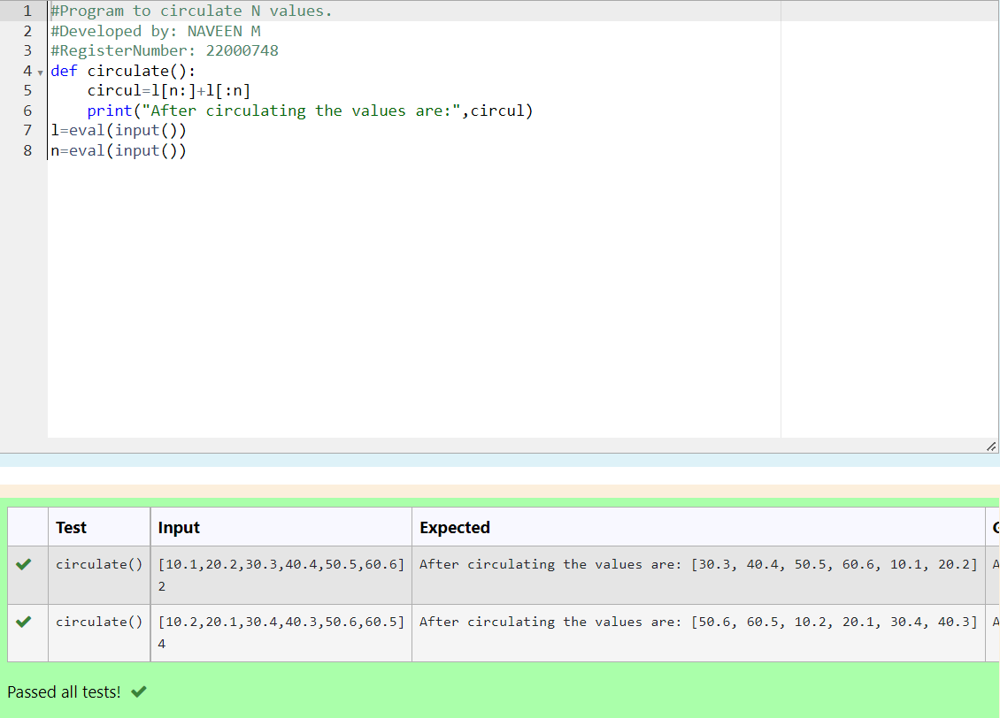

# Circulate-the-values-of-N-variables
## Aim:
To write a python program to circulate the n variables using function concept
## Equipment’s required:
PC
Anaconda - Python 3.7
## Algorithm: 
### Step 1: Get the values from the user
### Step 2: And also get the input for number of rotation 
### Step 3: Assign the value of the first variable to the second variable. Get the value from the user for the number of rotation
### Step 4: Using the slicing concept rotate the list
### Step 5: Print the values after circulating it.
### Step 6: End the program
## Program:
```python 
#Program to circulate N values.
#Developed by: NAVEEN M
#RegisterNumber: 22000748
def circulate():
    circul=l[n:]+l[:n]
    print("After circulating the values are:",circul)
l=eval(input())
n=eval(input())
```
## Output:

## Result: Thus the program successfully executed
